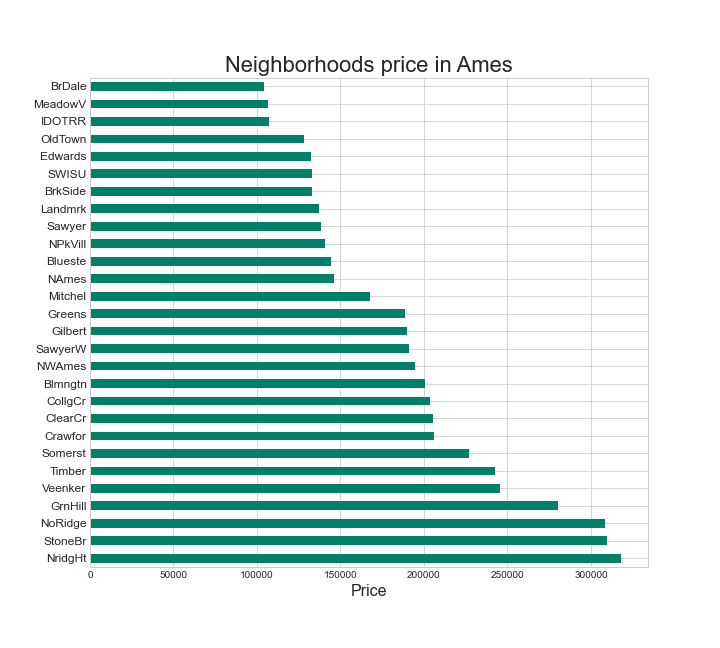

#  # Ames, Iowa prediction price Kaggle competition

## Problem statement:

My research aims to describe several factors that may affect the price of houses in Ames Iowa. I specifically focus on which towns in Ames had the highest sales rate between 2006-2010. The findings will be represented in a table with information about the model of linear regression to try to predict home values.

## Data descreption:

Description of the data [data description](http://jse.amstat.org/v19n3/decock/DataDocumentation.txt).

## Method:

To begin with the analysis of this research, the data will first be cleaned and organized to have more exact information. Then, the price of the houses will be analyzed concerning some features using a boxplot. Then, various types of graphs will be used to analyze the price and the neighborhoods to check if there is any change in the price of the houses concerning the neighborhoods. Finally, the best features will be chosen to predict the price of housing using regression models.

## Data cleaning:

As we can see, our data has several null values that we have to clean. I have decided to drop multiple columns because they really have no relevance to our model like *'PID', 'Alley', 'Fireplace Qu', 'Pool QC', 'Fence' and 'Misc Feature'*. The rest of the null values I decided to fill them in the best way that I thought.

## Feature Visualizations:

Visualizations allow us to analyze our data in a better way.

- In the price description table, we have the values in more detail, from the maximum, minimum, average values, etc.
- Comparing the data obtained in the boxplot graphs and the price histogram, we observe that most houses are in the range of $100000 and $200,000 dollars and with maximum values of $600,000. We also see that the price has a positive skew, this indicates that there are more values higher than the average price.
- Observing the price graph in relation to some numerical features, we can say that there are some features that have a regression line, however we have some outliers that must be removed to have a better prediction.
- In the boxplot chart we select different categorical features to see and analyze how the price value changes. In this graph we see that the Overall Qual is one of the most relevant for this model. Also, as in the previous graph we see that there are several outliers that have to be removed.

#### Prices of the house by neighborhood

- In the previous graph we can analyze that there are a total of 28 neighborhoods in Ames, Iowa. For the purpose of this analysis we are going to focus on the 3 most expensive neighborhoods (Stone Brook, Northridge Heights and Northridge) with an average greater than $300,000.
- When analyzing the size of the properties with respect to price, we see that the neighborhoods of Stone Brook and Northridge Heights are neighborhoods where houses of various prices and a great variety of sizes can be found. On the other hand the Northridge neighborhood does not have the same availability in house size and we can see how the size of the houses are in a small group between 9000 and 15000 square feet.

## Feature selection and correlation graphic:

heat map to find the correlation 

- we assign the variable value of * saleprice * as our target.

- With the help of the *sklearn* library we can use the *SelectKbest * module to select the 10 best features. We can also use the correlation table to see which features have the highest correlation.

- I have chosen the 12 best features that had high and low correlation

- At the end we can see the correlation that have the 10 best features, we see the *Overall Qual* has the highest correlation.

## 7. Creating models:

- ### Linear regression model: Sklearn model

To create this new model we are going to use the sklearn library. This model is going to be divided into two parts *(X_train and X_test)* and we are going to divide it into 70% and 30%. then we are going to *scale* our data to proceed to instance the module. We are going to do *Cross validation* and see our coefficients. then we are going to check metrics and make predictions.

- Predictions: 

- Metrics values:

|          | cross_val_score | R-Squared | MAE      | RMSE      |
|----------|-----------------|-----------|----------|-----------|
| Training | 0.8580          | 0.8642   | 20358.4 | 27854.67 |
| Testing  | 0.8678         | 0.8724   | 20428 | 26937.05 |

- As we can see in the first regression model, the metrics are slightly overfitting. The performance of the model, in general, is not as bad as the R-Squared indicates, which is 86%. Another metric to consider in this model is the RMSE which indicates that the model is 27854 off. Analyzing these metrics, we could determine that the model could improve the performance.

- ### Ridge and Lasso:

Trying to improve our model we are going to use some regulations like Ridge and Lasso.
For Ridge we are going to put a value for alpha of 10 and for Lasso a value of 5.
As we can see, there is not much difference between the results.

- Metrics values:

|           | RIDGE                          | LASSO                          |
|-----------|--------------------------------|--------------------------------|
| R-Squared | Train: 0.864 / Test: 0.872     | Train: 0.864 / Test: 0.872    |
| RMSE      | Train: 27856.90 / Test: 26934.35 | Train: 27854.6 / Test: 26937.3 |
| MAE       | Train: 20346.72 / Test: 20398.22 | Train: 20357.66 / Test: 20426.97 |

- ### Linear regression model: Sklearn,Polynomial features and Ridge.

To try to improve this model, more features will be created using the sklearn function (PolynimialFeatures). Bearing this in mind, we could expect the models to increase overfitting. For this, the Rigde model will be used to try to counteract it.

- Predictions: 

- Metrics values:

|           | LINEAR REGRESION                          | RIDGE                          |
|-----------|--------------------------------|--------------------------------|
| R-Squared | Train: 0.922 / Test: 0.859     | Train: 0.909 / Test: 0.887    |
| RMSE      | Train: 21166.38 / Test: 28185.15 | Train: 22863.92 / Test: 25304.65 |
| MAE       | Train: 15471.93 / Test: 19556.15 | Train: 16631.15 / Test: 17452.55 |

- When looking at these two models (Linear regression and Ridge), we notice that they have more overfitting than all the previous models, this is because polynomial features were used to increase the number of features for these models. The metrics also indicate that the performance increased by 85.5% for the Linear regression model and 88.7% for the Ridge model.

## Conclusions:
---

To conclude this analysis of house prices in Ames, Iowa, we find that after cleaning and organizing the data, house prices can vary from $12,789 to $611,657, depending on the features observed in the previous graphs.

Stone Brook, Northridge Heights and Northridge were the neighborhoods that had the most expensive average house prices, also these neighborhoods have a high overall rating as shown in the graph.

In the first regression models (Linear regression, Ridge, and Lasso) the metrics were quite similar, the models are slightly overfitting, and the performance was not so bad. To try to improve the model, the features were increased using Sklearn (PolynomialFeatures), this improved the performance up to 88.7% but increased the overfitting as expected, also decreased the value of RMSE and MAE.

I personally think that increasing the number of features is a good idea to improve the model. Different types of regression models such as decision tree or Random Forest could also be explored.
